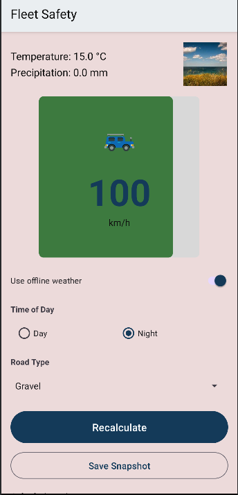
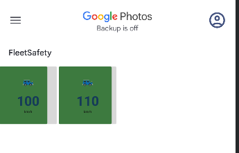

# Fleet Safety

Aplicación móvil Android que calcula y muestra una **velocidad máxima segura** para el conductor según:
- Condiciones climáticas en tiempo real (Open-Meteo).
- Tipo de camino (asfalto / ripio).
- Momento del día (día / noche).
- Reglas y límites configurados por un administrador.

## Demo

## ¿Qué problema resuelve?

En flotas pequeñas y medianas, los conductores suelen carecer de una referencia **dinámica** de velocidad segura que contemple clima y contexto. Fleet Safety ofrece una recomendación clara, explicable y configurable, reduciendo incidentes y estandarizando criterios operativos.

## ¿Para quién está pensado?

- **Conductores (Driver):** ven un tablero simple con la velocidad segura y su justificación.
- **Administradores (Admin):** definen límites mínimos/máximos/base y supervisan el comportamiento esperado.

## Funcionalidades clave

- **Velocidad segura en tiempo real:** motor de reglas que combina ajustes del admin + clima.
- **Clima online u offline:** toma datos de Open-Meteo (fallback a condiciones por defecto).
- **Historial de cálculos:** cada recálculo agrega una tarjeta con hora, valor y explicación.
- **Configuración del administrador:** mínimos, máximos y base persistidos localmente.
- **Sistema de autenticación:** registro y login con Firebase Authentication.
- **Base de datos en la nube:** sincronización de usuarios y configuraciones con Firestore.
- **Control de acceso por roles:** usuarios driver y admin con permisos diferenciados.

## Tecnologías y stack

- **Lenguaje:** Java (Android).
- **UI:** Material 3, `ConstraintLayout`, `LinearLayout`, View Binding.
- **Autenticación:** Firebase Authentication (Email/Password).
- **Base de datos:** Firebase Firestore (colección users).
- **Datos remotos:** Open-Meteo (HTTP + JSON).
- **Concurrencia:** `ExecutorService` + `Handler` (main thread).
- **Persistencia local:** `SharedPreferences`.
- **Build:** Gradle (Android Studio).

## Firebase Integration

### Firebase Authentication

Firebase Authentication gestiona el registro y autenticación de usuarios mediante email y contraseña. La aplicación implementa:

- Registro de nuevos usuarios con validación de datos
- Login con credenciales persistentes
- Gestión de sesiones activas
- Logout con limpieza de estado

Cada usuario autenticado recibe un UID único que se utiliza como identificador en Firestore para vincular sus datos personales y configuraciones.

### Firebase Firestore

Firestore almacena y sincroniza los datos de usuarios en tiempo real. La estructura de la base de datos incluye:

**Colección: `user`**
- `mail`: Email del usuario
- `name`: Nombre completo del usuario
- `password`: Contraseña (almacenada para propósitos académicos)
- `role`: Rol del usuario (driver/admin)
- `baseSpeed`, `minSpeedLimit`, `maxSpeedLimit`: Configuraciones de velocidad personalizadas
- `updatedAt`: Timestamp de última actualización

La aplicación realiza operaciones CRUD sobre Firestore:
- **Create**: Al registrar un nuevo usuario
- **Read**: Al cargar datos del usuario y configuraciones
- **Update**: Al modificar configuraciones desde AdminSettings
- El sistema de roles determina qué funcionalidades están disponibles para cada usuario

## Arquitectura (capas)

- `data.remote`
    - `OpenMeteoWeatherService`: fetch de clima asíncrono (HTTP) + parseo JSON.
    - `WeatherMapper` / `WeatherCallback`: mapeo de respuesta a dominio.
- `domain`
    - Modelos (`DriverSettings`, `WeatherSnapshot`, enums).
    - `SpeedRuleEngine`: motor de reglas (penalizaciones por ripio/noche/lluvia/nieve/hielo, clamps globales y por admin).
- `ui`
    - `LoginActivity`: autenticación de usuarios.
    - `RegisterActivity`: registro de nuevos usuarios.
    - `MainActivity`: menú de entrada (Driver / Admin) con control de roles.
    - `DriverDashboardActivity`: tablero del conductor con cálculo de velocidad.
    - `AdminSettingsActivity`: configuración del administrador con sincronización Firestore.
    - `SettingsStore`: wrapper de `SharedPreferences`.

## Estructura del proyecto

app/

└─ src/main/java/com/fleet/safety/

├─ data/remote/ (HTTP + JSON + mappers)

├─ domain/ (modelos + motor de reglas)

└─ ui/ (activities + binding + store)

└─ res/

├─ layout/ (XML de pantallas)

├─ drawable/ (gauge/progress, íconos SVG)

├─ values/ (strings, colors, dimens, styles)

└─ mipmap/ (adaptive icon)

## Cómo ejecutar

1. Abrir el proyecto en **Android Studio** (Gradle sincronizado).
2. Ejecutar en un emulador o dispositivo con Android 8.0+.
3. Permisos: solo **INTERNET** (para clima online).

> Si no hay red, activar **“Use offline weather”** en el tablero para forzar condiciones por defecto.

## Estado y roadmap

- ✅ MVP con tablero de conductor, configuración admin, historial, íconos vectoriales y animación de progreso. DONE
- 🔜 Próximos: autenticación (login), alta de usuarios (ABM) desde Admin, registros y métricas. DONE

## Mas info

Ver [**Wiki**](https://github.com/1337B/parcial-1-am-acn4bv-bielaszczuk-cristhian/wiki) para detalles de arquitectura, pantallas y flujo.

## Nuevos features

### Captura de pantalla del dashboard

Se agregó la funcionalidad de guardar snapshots del dashboard del conductor. El usuario puede capturar el estado actual del tablero con todos los datos de velocidad, clima y condiciones, y guardarlo directamente en la galería del dispositivo. Las imágenes guardadas incluyen metadata en los campos EXIF con información relevante como velocidad segura calculada, condiciones climáticas y ubicación GPS.

### Integración con Retrofit para Open-Meteo

La aplicación ahora utiliza Retrofit con Moshi para realizar las consultas a la API de Open-Meteo, reemplazando la implementación manual con HttpURLConnection. Esta integración proporciona mejor manejo de errores, conversión automática de JSON y código más mantenible.
